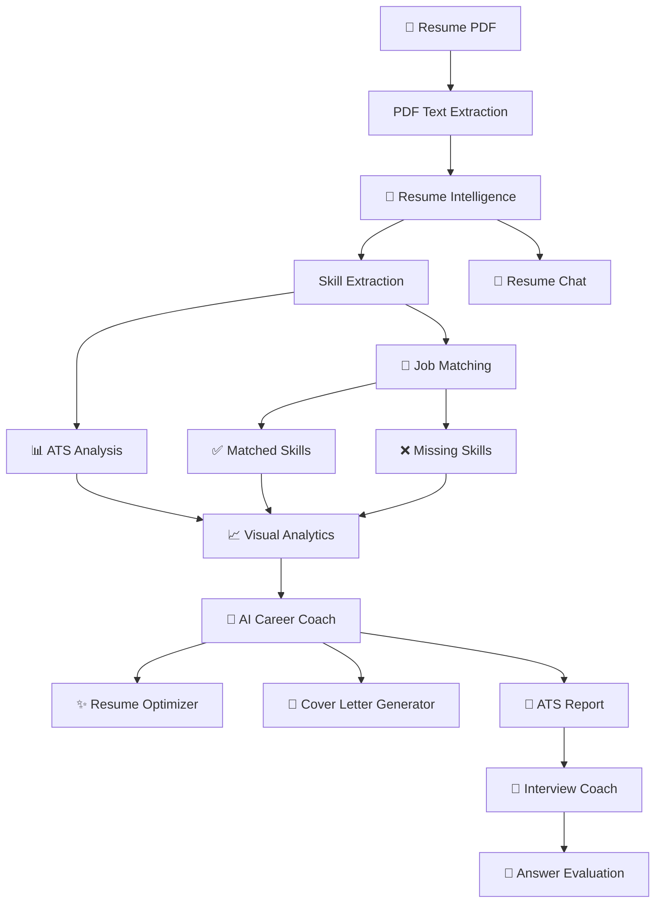
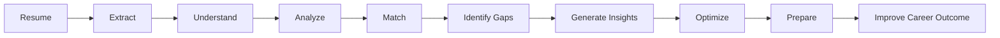
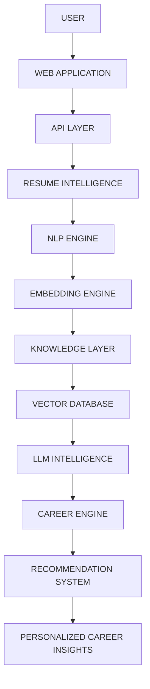

<div align="center">


<br>


<br><br>


<br><br>


</div>

---

# 🧠 What is Resume Analyzer AI?

**Resume Analyzer AI** is an AI-powered **Career Intelligence Platform** that transforms a traditional resume into structured, actionable career insights.

Instead of simply checking whether a resume contains keywords, the platform analyzes the resume from multiple perspectives:

<div align="center">

| 🧠 Resume Intelligence |  🎯 Career Intelligence |
| :--------------------: | :---------------------: |
|  Resume Understanding  |       Job Matching      |
|    Skill Extraction    |   Skill Gap Detection   |
|      ATS Analysis      |     Career Feedback     |
|   Resume Optimization  |  Interview Preparation  |
|    Resume Analytics    | Resume-grounded AI Chat |

</div>

The platform combines:

**PDF Processing + NLP + Skill Intelligence + ATS Analysis + Job Matching + Visual Analytics + Generative AI**

into a single career-focused application.

---

# ✨ The Intelligence Layer

<div align="center">


<br><br>

<table width="95%" cellspacing="0" cellpadding="18">

<tr>

<td align="center">

### 📄

**RESUME**

Upload and process a PDF resume.

</td>

<td align="center">

### 🧠

**UNDERSTAND**

Extract text, skills and career information.

</td>

<td align="center">

### 📊

**MEASURE**

Calculate ATS-oriented scores.

</td>

</tr>

<tr>

<td align="center">

### 🎯

**MATCH**

Compare resume with job requirements.

</td>

<td align="center">

### 💡

**IMPROVE**

Generate actionable recommendations.

</td>

<td align="center">

### 🚀

**PREPARE**

Optimize applications and interviews.

</td>

</tr>

</table>

</div>

---

# 🎯 Project Vision

The goal of Resume Analyzer AI is simple:

> **Turn a resume into a personalized career intelligence system.**

Traditional resume checkers usually stop at:

`Resume → Score`

Resume Analyzer AI expands this into:

`Resume → Understanding → Analysis → Matching → Recommendations → Optimization → Interview Preparation`

This makes the platform useful throughout the complete job-application workflow.

---

# 🌌 Platform Overview

<div align="center">


<br><br>


</div>

---

# 🔬 Core Features

## 📄 01 — Resume Processing

The platform accepts PDF resumes and extracts their textual content for downstream analysis.

**Capabilities**

* PDF upload
* Text extraction
* Resume parsing
* Structured analysis pipeline
* Centralized processing

---

## 🧠 02 — Intelligent Skill Extraction

The system identifies relevant technical and professional skills from the resume.

Examples include:

`Python` · `Machine Learning` · `Deep Learning`

`PyTorch` · `Scikit-Learn` · `SQL`

`NLP` · `Computer Vision` · `Generative AI`

The extracted skills become the foundation for ATS analysis and job matching.

---

## 📊 03 — ATS Scoring

Resume Analyzer AI calculates an ATS-oriented score based on resume characteristics and detected information.

The system evaluates areas such as:

* Skill coverage
* Education information
* Experience indicators
* Resume relevance
* Job alignment

The result is presented as an understandable score rather than raw processing output.

---

## 🎯 04 — Job Matching

Users can provide a target Job Description and compare it against their resume.

The matching engine identifies:

### ✅ Matched Skills

Skills present in both the resume and target job.

### ❌ Missing Skills

Important skills mentioned in the job description but absent from the resume.

### 📊 Match Score

An overall indication of how closely the resume aligns with the target role.

---

## 📈 05 — Visual Analytics

The platform converts analysis results into visual representations.

Current visualizations include:

* ATS score breakdown
* Skill distribution
* Resume skill count
* Job skill count
* Matched skill count
* Missing skill count
* Job matching analytics

The purpose is to make resume analysis easier to understand at a glance.

---

# 🤖 AI Career Intelligence

<div align="center">


</div>

---

## 💡 AI Career Coach

The AI Career Coach uses the results of the resume analysis pipeline to provide personalized career feedback.

It can help identify:

* 💪 Resume strengths
* ⚠️ Weak areas
* ❌ Missing skills
* 🎯 Job alignment problems
* 📊 ATS improvement opportunities
* 💡 Recommended improvements
* 🧭 Career development priorities

The objective is not simply to say **what is wrong**, but to explain **what can be improved**.

---

# ✨ Resume Optimizer

The Resume Optimizer extends the analysis system into resume improvement.

It focuses on:

* Stronger professional wording
* Better skill presentation
* ATS keyword alignment
* Job-specific improvements
* Project descriptions
* Resume structure
* Career positioning

### Optimization Flow

<div align="center">


</div>

---

# 💌 AI Cover Letter Generator

The platform can generate a job-focused cover letter using information from the resume and target job description.

The generated content can consider:

* Candidate skills
* Projects
* Experience
* Target role
* Job requirements
* Relevant strengths

This creates a complete application workflow:

**Resume → Job Match → Resume Optimization → Cover Letter**

---

# 📄 ATS Report Generator

Resume analysis can be converted into a downloadable ATS-oriented report.

The report can contain:

| Analysis         | Output                      |
| ---------------- | --------------------------- |
| 📊 ATS Score     | Overall resume score        |
| 📈 ATS Breakdown | Score distribution          |
| 🧠 Resume Skills | Detected skills             |
| 💼 Job Skills    | Required skills             |
| ✅ Matched Skills | Matching capabilities       |
| ❌ Missing Skills | Skill gaps                  |
| 🎯 Job Match     | Alignment score             |
| 📋 Suggestions   | Improvement recommendations |
| 🤖 AI Feedback   | Career intelligence         |

---

# 🎤 AI Interview Coach

Resume Analyzer AI extends beyond resume preparation into **interview preparation**.

The interview system can generate questions based on:

* Resume content
* Skills
* Projects
* Experience
* Target job description
* Technical requirements

### Interview Intelligence

<div align="center">

<table width="90%" cellspacing="0" cellpadding="18">

<tr>

<td align="center">

🎯

**QUESTION GENERATION**

Role-specific interview questions.

</td>

<td align="center">

🧠

**ANSWER ANALYSIS**

Evaluate candidate responses.

</td>

<td align="center">

💻

**TECHNICAL EVALUATION**

Assess technical understanding.

</td>

</tr>

<tr>

<td align="center">

💬

**COMMUNICATION**

Analyze answer clarity.

</td>

<td align="center">

🎤

**CONFIDENCE**

Evaluate response confidence.

</td>

<td align="center">

📈

**FEEDBACK**

Provide actionable improvements.

</td>

</tr>

</table>

</div>

---

# 💬 Resume Chat

Resume Chat enables users to interact with their uploaded resume through natural-language questions.

### Example Questions

```text
What technical skills are present in my resume?

What machine learning projects have I completed?

What programming languages do I know?

What are my strongest technical areas?

What skills am I missing for this job?

What experience do I have with Python?

What projects should I highlight during an interview?
```

The objective is to make the resume **interactive rather than static**.

---

# 🧬 System Architecture

<div align="center">


</div>



---

# 🔄 End-to-End Intelligence Pipeline



<div align="center">


</div>

---

# 🧩 Modular Project Architecture

The project follows a modular Python architecture where individual components handle dedicated responsibilities.

```text
resume-analyzer-ai/
│
├── analyzer/
│   │
│   ├── __init__.py
│   ├── pdf_reader.py
│   ├── skill_extractor.py
│   ├── ats_score.py
│   ├── jd_matcher.py
│   ├── ai_feedback.py
│   ├── chart_generator.py
│   ├── resume_service.py
│   └── suggestions.py
│
├── assets/
│   └── charts/
│
├── app.py
├── requirements.txt
├── README.md
└── .gitignore
```

---

# 🧠 Module Intelligence Map

| Module               | Responsibility               |
| -------------------- | ---------------------------- |
| `pdf_reader.py`      | Resume PDF text extraction   |
| `skill_extractor.py` | Skill detection              |
| `ats_score.py`       | ATS score calculation        |
| `jd_matcher.py`      | Resume-JD matching           |
| `ai_feedback.py`     | AI-generated feedback        |
| `chart_generator.py` | Analysis visualizations      |
| `resume_service.py`  | Central analysis workflow    |
| `suggestions.py`     | ATS improvement suggestions  |
| `app.py`             | Gradio application interface |

---

# 🏗️ Engineering Design

A major design decision in the project was introducing a centralized analysis service.

### `resume_service.py`

Instead of allowing the UI to directly coordinate every analysis module, the application can use a centralized service layer.

This provides:

* Cleaner UI logic
* Better separation of concerns
* Reusable analysis workflow
* Easier debugging
* Easier future API integration
* Better maintainability
* Cleaner project architecture

### Concept

```text
                USER INTERFACE
                      │
                      ▼
              RESUME SERVICE
                      │
        ┌─────────────┼─────────────┐
        ▼             ▼             ▼
      PDF          SKILLS          ATS
      ENGINE       ENGINE         ENGINE
        │             │             │
        └─────────────┼─────────────┘
                      │
                      ▼
                JOB MATCHING
                      │
                      ▼
               AI INTELLIGENCE
                      │
                      ▼
                  OUTPUTS
```

---

# 🎨 User Interface

The project uses **Gradio** to provide an interactive AI application interface.

The interface is designed around the complete analysis workflow:

<div align="center">

<table width="95%" cellspacing="0" cellpadding="16">

<tr>

<td align="center">📄<br><b>UPLOAD</b><br>Resume PDF</td>

<td align="center">🎯<br><b>COMPARE</b><br>Job Description</td>

<td align="center">🚀<br><b>ANALYZE</b><br>Run AI Analysis</td>

<td align="center">📊<br><b>UNDERSTAND</b><br>View Results</td>

</tr>

<tr>

<td align="center">🤖<br><b>COACH</b><br>AI Feedback</td>

<td align="center">✨<br><b>OPTIMIZE</b><br>Improve Resume</td>

<td align="center">🎤<br><b>PRACTICE</b><br>Interview</td>

<td align="center">💬<br><b>CHAT</b><br>Resume Chat</td>

</tr>

</table>

</div>

---

# 🛠️ Technology Stack

<div align="center">


<br><br>


</div>

---

# ⚙️ Technology Responsibilities

| Technology            | Purpose                      |
| --------------------- | ---------------------------- |
| 🐍 **Python**         | Core application development |
| 🎨 **Gradio**         | Interactive web interface    |
| 📄 **PDF Processing** | Resume document extraction   |
| 🧠 **NLP**            | Text and skill analysis      |
| 📊 **Scikit-Learn**   | Machine learning utilities   |
| 🔥 **PyTorch**        | Deep learning ecosystem      |
| 🐼 **Pandas**         | Data processing              |
| 🔢 **NumPy**          | Numerical computation        |
| 📈 **Matplotlib**     | Data visualization           |
| 🤗 **Hugging Face**   | AI / LLM integration         |
| 🔧 **Git**            | Version control              |
| 🐙 **GitHub**         | Repository management        |

---

# 🚀 Installation

## 01 — Clone

```bash
git clone https://github.com/shubhamkardel-ai/resume-analyzer-ai.git

cd resume-analyzer-ai
```

## 02 — Virtual Environment

### Windows

```bash
python -m venv .venv

.venv\Scripts\activate
```

### Linux / macOS

```bash
python3 -m venv .venv

source .venv/bin/activate
```

## 03 — Dependencies

```bash
pip install -r requirements.txt
```

---

# 🔐 Environment Configuration

If AI model access requires authentication, create:

```text
.env
```

Example:

```env
HF_TOKEN=your_huggingface_token
HF_MODEL=your_model_name
```

### Never commit:

```text
.env
.venv/
__pycache__/
*.pyc
.idea/
.vscode/
```

---

# ▶️ Run the Application

```bash
python app.py
```

The Gradio interface will normally be available at:

```text
http://127.0.0.1:7860
```

---

# 🧪 How to Use

<div align="center">


</div>

| Step   | Action                        |
| ------ | ----------------------------- |
| **01** | 📄 Upload Resume PDF          |
| **02** | 📝 Add target Job Description |
| **03** | 🚀 Run analysis               |
| **04** | 📊 Review ATS score           |
| **05** | 🧠 Review extracted skills    |
| **06** | 🎯 Check job match            |
| **07** | ❌ Identify missing skills     |
| **08** | 🤖 Review AI feedback         |
| **09** | ✨ Optimize resume             |
| **10** | 💌 Generate cover letter      |
| **11** | 📄 Generate ATS report        |
| **12** | 🎤 Practice interview         |
| **13** | 💬 Chat with resume           |

---

# 📊 Analysis Dashboard

The platform produces multiple layers of career intelligence.

```text
RESUME
   │
   ├── ATS SCORE
   │
   ├── SKILLS
   │
   ├── EXPERIENCE
   │
   ├── EDUCATION
   │
   └── PROJECT INFORMATION
          │
          ▼
       JOB MATCH
          │
     ┌────┴────┐
     ▼         ▼
  MATCHED    MISSING
  SKILLS     SKILLS
     │         │
     └────┬────┘
          ▼
    AI CAREER INSIGHTS
          │
     ┌────┼────┐
     ▼    ▼    ▼
 OPTIMIZE COVER INTERVIEW
          │
          ▼
     CAREER ACTION
```

---

# 🎯 Target Roles

Resume Analyzer AI can be used to evaluate resumes against roles such as:

<div align="center">


</div>

---

# 📈 Project Status

<div align="center">


<br><br>


</div>

### Completed Core System

```text
✓ PDF Resume Processing
✓ Skill Extraction
✓ ATS Scoring
✓ ATS Breakdown
✓ Job Description Matching
✓ Matched Skill Detection
✓ Missing Skill Detection
✓ Skill Analytics
✓ ATS Charts
✓ AI Career Feedback
✓ Resume Optimization
✓ Cover Letter Generation
✓ ATS PDF Reports
✓ AI Interview Coach
✓ Interview Answer Evaluation
✓ Resume Chat
✓ Modular Architecture
✓ Centralized Resume Service
✓ Gradio Interface
```

<div align="center">


</div>

---

# 🔮 Future Evolution

The current application is **complete as a functional portfolio project**.

Future versions may extend the system toward a more advanced production architecture.

## 🟣 Advanced NLP

* Semantic skill matching
* Transformer embeddings
* Sentence similarity
* Semantic resume understanding
* Context-aware job matching

## 🔵 Knowledge Intelligence

* Vector database integration
* Resume knowledge retrieval
* Job knowledge base
* Semantic search
* Retrieval-Augmented Generation

## 🟢 Production Engineering

* FastAPI backend
* Authentication
* Resume history
* Database integration
* Docker deployment
* Cloud deployment
* CI/CD
* MLOps monitoring

## 🟠 Career Intelligence

* Personalized career paths
* Job recommendation engine
* Skill learning recommendations
* Resume version comparison
* Career progress tracking

> These are **future expansion ideas**, not claims about the current implementation.

---

# 🌐 Future Architecture



---

# 🧠 Engineering Lessons

Building Resume Analyzer AI provided practical experience across multiple areas of AI engineering.

<div align="center">

<table width="95%" cellspacing="0" cellpadding="15">

<tr>

<td align="center">

🐍

### PYTHON

Application architecture and modular development.

</td>

<td align="center">

🧠

### NLP

Text processing and skill intelligence.

</td>

<td align="center">

📊

### ML

Scoring and matching systems.

</td>

</tr>

<tr>

<td align="center">

🤖

### GENAI

AI-powered career features.

</td>

<td align="center">

📈

### ANALYTICS

Visual interpretation of results.

</td>

<td align="center">

🏗️

### ARCHITECTURE

Service-oriented modular design.

</td>

</tr>

</table>

</div>

---

# 🔒 Security

Never expose authentication credentials inside the repository.

Keep sensitive information inside environment variables.

```env
HF_TOKEN=your_huggingface_token
HF_MODEL=your_model_name
```

Recommended `.gitignore`:

```gitignore
.env
.venv/
__pycache__/
*.pyc
.idea/
.vscode/
```

---

# 🤝 Contributing

Contributions, ideas and improvements are welcome.

```bash
git checkout -b feature/your-feature

git add .

git commit -m "feat: add your feature"

git push origin feature/your-feature
```

Then create a Pull Request.

---

# 📜 License

This project is intended for **educational, portfolio and research purposes**.

If the project is distributed publicly, an appropriate open-source license should be added to the repository.

---

# 👨‍💻 Author

<div align="center">


<br><br>


<br><br>

<a href="https://github.com/shubhamkardel-ai">

</a>

<a href="https://www.linkedin.com/in/shubham-kardel-303356312/">

</a>

</div>

---

# 🌟 Final Message

<div align="center">


<br><br>

<table width="85%" cellspacing="0" cellpadding="25">

<tr>

<td align="center">

### 🚀 Resume Analyzer AI

<br>

**Understand. Analyze. Match. Improve. Prepare.**

<br>

A complete AI-powered career intelligence platform designed to transform resume data into actionable career insights.

<br><br>


<br><br>

⭐ **If you find the project useful, consider giving it a star.** ⭐

</td>

</tr>

</table>

<br>


<br><br>


</div>
